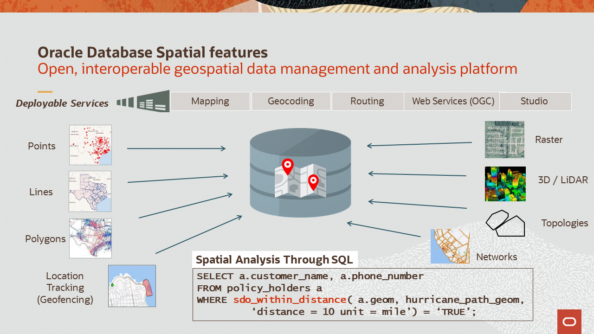

# Workshop Introduction and Overview #

## Introduction to Oracle Spatial

Oracle’s mission is to help people see data in new ways, discover insights, and unlock endless possibilities. Spatial analysis is about understanding complex interactions based on geographic relationships – answering questions based on where people, assets, and resources are located. Spatial insights enable you to provide better customer service, optimize your workforce, locate retail and distribution centers, evaluate sales and marketing campaigns, and more. With Oracle’s spatial offerings, developers, database professionals, and analysts can use a comprehensive suite of spatial data management, analytics, and visualization tools to integrate spatial analysis and mapping into applications on enterprise grade data management infrastructure – Oracle Database and Oracle Exadata. Innovative technologies of Oracle Cloud Gen 2 and Oracle Autonomous Database, the industry’s only self-driving, self-securing, and self-repairing database, are available to spatial applications. 

In this tutorial, you learned how to:

- Create tables with a geometry columns
- Insert spatial metadata
- Create Spatial Index
- Load data with geometries
- Perform location-based queries

## More Information on Spatial

Please see the Spatial Developer's Guide at [https://docs.oracle.com/en/database/oracle/oracle-database/19/spatl/index.html](https://docs.oracle.com/en/database/oracle/oracle-database/19/spatl/index.html)

## Acknowledgements

- **Authors/Contributors** - Minqiao Wang, DB Product Management, April 2020
- **Last Updated By/Date** - 
- **Workshop Expiration Date** - 

See an issue?  Please open up a request [here](https://github.com/oracle/learning-library/issues).   Please include the workshop name and lab in your request. 
